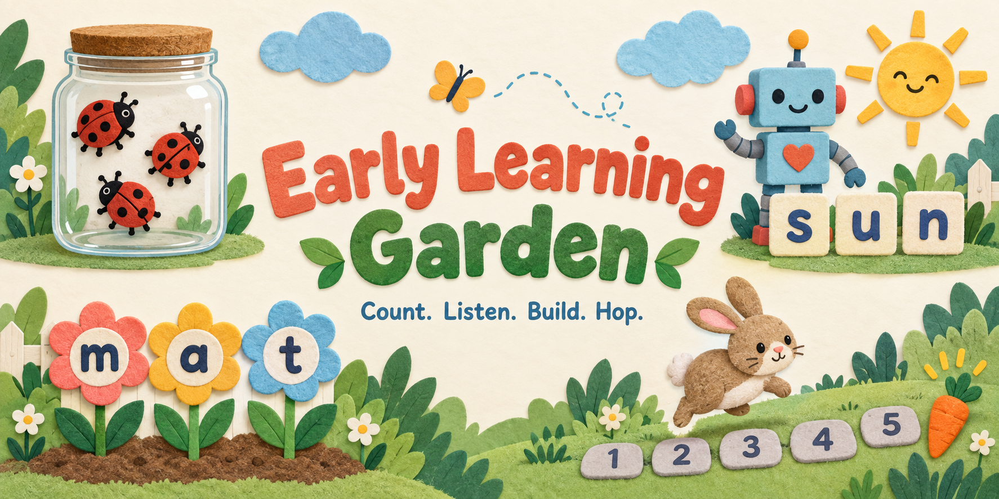

# Early Learning Garden

**Four little games for counting, letter sounds and putting words together. Built to play together.**

- **[Play in your browser](https://jessemaddox.com/projects/early-learning-garden/play/)**
- **[Download all four games for offline play](https://github.com/jessecmaddox3/early-learning-garden/releases/download/v1.0.0/early-learning-garden-1.0.0-offline.zip)**

I built this for me and my personal use, then cleaned it up so other people could use the whole thing. Make it your own, and feel free to improve mine. Hopefully it gives you a useful starting point, or at the very least some ideas. Cheers!

## Start here, even if you do not use GitHub

Click **Play in your browser**, then pick a picture. No account, subscription, AI service or installation is needed. Each game starts as **Player 1**. Open **Learners and backups** to add a nickname or switch learners.

**Play with a grown-up for the sound games.** This release includes no recorded voice pack. Letter Garden and Robot Words show a sound cue for an adult to model aloud. Press **Sound modelled, continue** when ready; each queued sound waits for you. You can add your own recordings instead. Optional device speech reads instructions and whole words using a local English voice when available. It never silently substitutes letter names for the sounds being taught.

For a copy you can keep on a computer:

1. Download the offline ZIP above. You do not need a GitHub account or the green Code button.
2. Open the ZIP and extract its folder. On Windows, right-click it and choose **Extract All**. On a Mac, double-click it.
3. Open **Early-Learning-Garden.html** inside the extracted folder. Keep the five HTML files together so its picture menu can open every game.
4. Play in your browser. The complete games work without internet. Sound practice remains adult-led unless you add recordings or enable an available local device voice.

Each game is also a complete standalone HTML file in that folder. Open one directly if you prefer. Keep using the same file and browser, and export progress before moving files, changing browsers or clearing browser data.

## Pick a picture

| Game | What happens |
| --- | --- |
| 🐞 **How Many?** | A quick glimpse of bugs, then three number choices. Start with quantities 1–3 in patterns, move to scattered groups, then two clusters totalling 5–6. Look again keeps the same question. A miss reveals and counts the bugs. Eight successful answers finish a session. |
| 🤖 **Robot Words** | Drag or tap the robot across the letters, model or play their sounds, then choose the matching picture. All 12 original words remain across three stages. A keyboard can use arrows and End. Six successful answers finish a session. |
| 🌻 **Letter Garden** | Model a sound and choose its letter flower. All 18 letters appear in five waves; weaker items receive more practice, and earlier letters stay in the mix. Eight successful answers bring a rainbow and a Play again button. |
| 🐰 **Bunny Hops** | Hop along a straight numbered path to a carrot. Start with five spaces, progress to ten, then start farther along. Say the numeral reached at each hop and the total hops at arrival. Six journeys finish a session. |

These are editorial practice rules, not measured school grades or a validated curriculum. The design notes explain the choices and limits. In *fox*, the final `x` represents two sounds, `/k/` and `/s/`; three letter tiles do not imply three phonemes.

## Sound and your own voice

Open **Sound and grown-up help** within a game. Adult-led cues work immediately. You can optionally enable a local device voice for instructions and words, mute sounds, or choose a folder of your own MP3 recordings. The app shows when no working local voice is available and keeps its text cues readable.

A local recording import stays in that page’s memory. Choose the folder again after reopening or moving to another game. Recordings never enter progress backups or cloud saves. The optional [recording guide](docs/recording.md) includes a complete script, pronunciation guidance, an editable splitting plan and a tool for creating the clip folder. Python and FFmpeg are needed only for that optional editing workflow.

## Keep your progress

Each game has separate local learners and readable JSON backups. Nicknames are labels, not accounts. Export saves the selected learner’s progress; Import creates a new learner without overwriting another one. Backups contain the nickname and progress, so keep them private.

Competing tabs preserve the losing attempt for recovery. Failed writes expose an exportable unsaved copy. Unreadable future-version saves remain recoverable. If browser storage is unavailable, the game says **Temporary session**; play and export before leaving. Browser storage is not encryption: anyone using the same browser can see its local learners.

Optional cloud saves need a host to configure its own backend and an adult to sign in by email code. The destination is shown first. Once a learner is attached and the account connected, local saves upload automatically. Other devices can preview and restore them. Sign-in stays in page memory, so reload requires a new sign-in. The offline files keep cloud disabled. [Host setup](docs/cloud-setup.md).

## Make it yours

Use, modify, share or sell your version under the [MIT license](LICENSE). Keep the license and [dependency notices](public/THIRD_PARTY_NOTICES.txt) with copies. No voice recording rights are granted for files you add yourself.

The complete application, word and letter banks, recording workflow, safe local/cloud storage and tests are included. [Design notes](docs/design.md) explain the mechanics. [Adaptation skill](skills/adapt-early-learning-garden/SKILL.md) gives an AI assistant useful context without private data.

For source editing, install [Node.js](https://nodejs.org/) version 22 or later. Download and extract the [source ZIP](https://github.com/jessecmaddox3/early-learning-garden/releases/download/v1.0.0/early-learning-garden-1.0.0-source.zip), open a terminal in that folder, then run:

```sh
npm ci --ignore-scripts
npm run build
npm start
```

Open the local address printed in the terminal. The build creates five offline HTML files in `artifacts/` and ready-to-host bundles in `public/`. Hosting under a repository subpath is supported. The source ZIP includes generated files, so `public/index.html` can also open directly in your browser.

## Development

```sh
npm test
python3 -m unittest discover -s test -p 'test_*.py'
python3 -m pip install playwright==1.58.0
python3 -m playwright install chromium
python3 scripts/test-games-browser.py
python3 scripts/test-audio-browser.py
python3 scripts/test-history-browser.py
python3 scripts/test-saves-browser.py
```

[Verification and limits](docs/verification.md), [contributing](CONTRIBUTING.md), [security reporting](SECURITY.md), and [source and asset provenance](docs/provenance.md).

This is an original, AI-assisted personal project. The banner was generated with ChatGPT. Playing requires no AI, tokens, API key or paid account.
